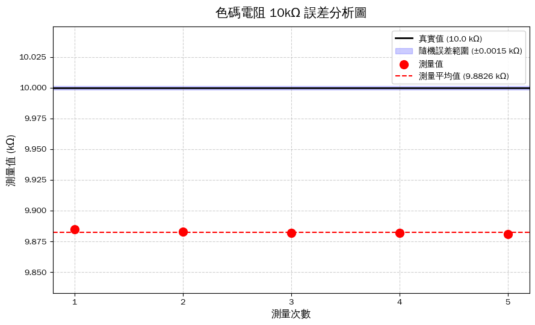
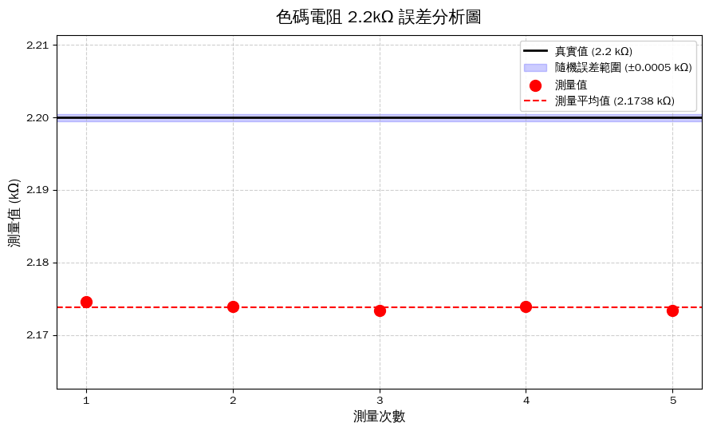
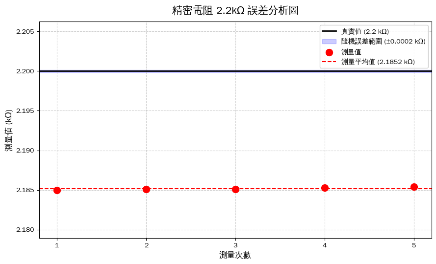

# 電子電路實習 - 實驗一：電阻量測與誤差分析

[-F9AB00?style=for-the-badge&logo=googlecolab&logoColor=white)](https://colab.research.google.com/github/Lorin1470/resistor-measurement-analysis/blob/main/resistor_analysis_batch.ipynb)
[-F9AB00?style=for-the-badge&logo=googlecolab&logoColor=white)](https://colab.research.google.com/github/Lorin1470/resistor-measurement-analysis/blob/main/resistor_analysis_custom.ipynb)

本專案提供「電子電路實習（實驗一）」修復後的 Python 繪圖與統計程式。解決了原版講義程式碼的繁體中文亂碼與字型顯示問題，並附上 Colab 執行說明與圖片。

---

## 如何在 Google Colab 上執行？

1. 點擊上方的 **「Open In Colab」** 按鈕即可直接在瀏覽器開啟 Jupyter Notebook。
2. 或打開瀏覽器進入 [Google Colab](https://colab.research.google.com/)，選擇從 GitHub 載入筆記本。
3. 依序執行儲存格（快捷鍵 `Shift + Enter`）。
4. **執行完成後**：終端機下方會直接顯示平均值、固定系統偏差、標準差與百分比誤差（可直接複製貼進結報），並即時繪製統計分析圖表。

---

## 程式說明

### 1. 多組批次整合版（`resistor_analysis_batch.ipynb` - 直接跑就行）
> **給組員的提醒**：
> `resistor_analysis_batch.ipynb` 已經將我們實驗量測到的 3 組電阻、各 5 次數據與標稱真值全部輸入完畢。**你不需要修改任何程式碼**，點擊 Colab 按鈕執行就可以拿到所有報告要寫的數據與圖表！

### 2. 單組自訂版（`resistor_analysis_custom.ipynb`）
若你使用的是單組版 `resistor_analysis_custom.ipynb` 或想測量其他電阻，請找到程式碼中的 **「第 2 區塊」** 進行修改：


```python
# ==========================================
# 2. 資料填寫區
# ==========================================

# 1. 測量數據：把量測到的數值填入陣列，數值間以半形逗號分開
measurements = np.array([9.885, 9.883, 9.882, 9.882, 9.881])

# 2. 標稱真實值：填入電阻的標準值（注意單位要與上方測量值一致）
true_value = 10.0  # 例如 10kΩ 填 10.0，2.2kΩ 填 2.2

# 3. 隨機誤差範圍：設定為計算測量數據之樣本標準差
random_error_range = np.std(measurements, ddof=1)
```

改好這三行後，按下 `Shift + Enter` 即可產生圖表。

---

## 本組實驗結果數據速查（結報第 6、7 項直接引用）

| 項目 / 規格 | 色碼電阻 10 kΩ | 色碼電阻 2.2 kΩ | 精密電阻 2.2 kΩ |
| :--- | :--- | :--- | :--- |
| **標稱真值 ($\mu$)** | 10.000 kΩ | 2.200 kΩ | 2.200 kΩ |
| **量測平均值 ($\bar{X}$)** | 9.8826 kΩ | 2.17384 kΩ | 2.18518 kΩ |
| **固定系統偏差 ($b$)** | -0.1174 kΩ | -0.02616 kΩ | -0.01482 kΩ |
| **隨機誤差 / 標準差 ($\sigma$)** | 0.00152 kΩ | 0.00049 kΩ | 0.00016 kΩ |
| **百分比誤差** | 1.174% | 1.189% | 0.674% |

---

## 輸出圖表

### 1. 色碼電阻 10kΩ 誤差分析圖


---

### 2. 色碼電阻 2.2kΩ 誤差分析圖


---

### 3. 精密電阻 2.2kΩ 誤差分析圖
